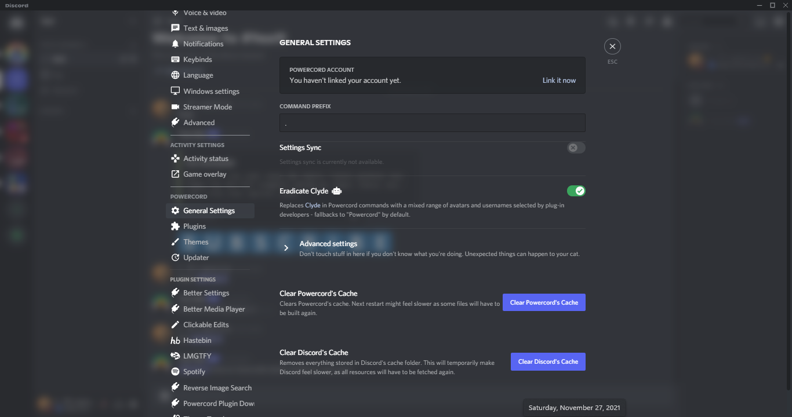

## SimpleUI

### A Beautiful and Simple theme for betterdiscord and powercord.

---

## How to install on betterdiscord
* Download from [github releases](https://github.com/Frazix-gamers/SimpleUi-For-PowerCord/releases)
* Select the `simpleui.theme.css` file and move to betterdiscord themes folder
* On Windows:
```
C:\Users\USERNAME\AppData\Roaming\BetterDiscord\themes
```
* On Linux:
```
/home/.config/BetterDiscord/themes
```
* On macOS:
```
/Users/(YourUser)/Library/Preferences/BetterDiscord/themes
```

---

## How to install on powercord

* Go to:
* on Windows:
```
C:\Users\USERNAME\Documents\powercord\src\Powercord\themes
```
* On Linux:
```
/home/powercord/src/Powercord/themes
```

* Clone this repository:
```
git clone https://github.com/Frazix-gamers/SimpleUi-For-PowerCord.git
```

* If you don't have git you can download the zip from [github releases](https://github.com/Frazix-gamers/SimpleUi-For-PowerCord/releases) and manually extract and put in the themes folder


Made by [Frazix](https://github.com/Frazix12)